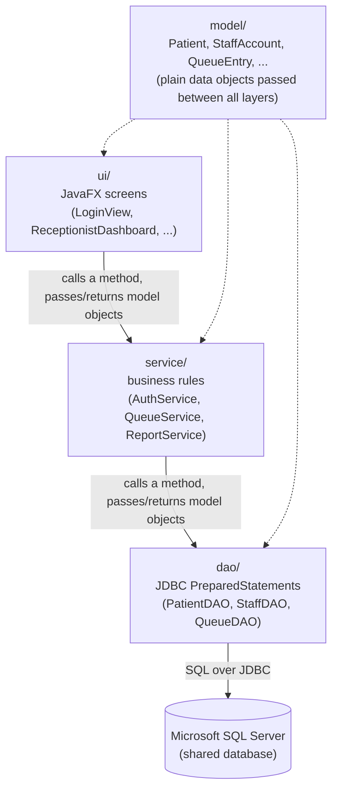

# hospital-queue-management

MediQueue is a Java desktop application designed to digitise patient queue management in hospitals across Zambia. It helps receptionists, nurses, and doctors coordinate patient flow in real time. From registration and triage through to doctor consultation, replacing manual, paper-based tracking with a shared, role-based system that reduces wait-time uncertainty and improves coordination among hospital staff.

## Tech stack

- **Language:** Java 25 (LTS)
- **GUI:** JavaFX 25
- **Build tool:** Maven, using the `javafx-maven-plugin` so the app runs the same way on every machine (`mvn javafx:run`) without anyone having to hand-configure JavaFX module paths
- **Data access:** JDBC (plain `PreparedStatement` queries, no ORM)
- **Database:** Microsoft SQL Server, administered through SSMS

## Project structure

```
hospital-queue-management/
├── README.md
├── .gitignore
├── pom.xml
├── Documentation/
│   ├── MediQueueProjectProposal.docx
│   └── MediQueue Week1 Meeting Minutes.docx
<<<<<<< HEAD
├── database/
│   └── schema.sql             # run once in SSMS to create the four tables below
└── src/
    └── main/
        ├── resources/
        │   ├── db.properties.example   # copy to db.properties and fill in your own details
        │   └── db.properties           # not committed - your own local connection settings
        └── java/
            └── mediqueue/
                ├── Main.java              # application entry point - wires everything together
=======
└── src/
    └── main/
        └── java/
            └── mediqueue/
                ├── Main.java              # application entry point
>>>>>>> 90648492df373e9b72511803c7830c1f1f1a2197
                │
                ├── model/                 # plain data classes, no logic
                │   ├── Patient.java
                │   ├── StaffAccount.java
                │   ├── Role.java
                │   ├── PatientStatus.java
<<<<<<< HEAD
                │   ├── AvailabilityStatus.java
                │   ├── DoctorAvailability.java
=======
>>>>>>> 90648492df373e9b72511803c7830c1f1f1a2197
                │   └── QueueEntry.java
                │
                ├── dao/                    # the only place JDBC/SQL code lives
                │   ├── DatabaseConnection.java
                │   ├── PatientDAO.java
                │   ├── StaffDAO.java
<<<<<<< HEAD
                │   ├── DoctorAvailabilityDAO.java
                │   └── QueueDAO.java
                │
                ├── service/                # business rules and role checks; talks to dao/, knows nothing about the UI
                │   ├── AuthService.java
                │   ├── AuthenticationException.java
                │   ├── QueueService.java
                │   ├── ReportService.java
                │   └── DailySummary.java
=======
                │   └── QueueDAO.java
                │
                ├── service/                # business rules; talks to dao/, knows nothing about the UI
                │   ├── AuthService.java
                │   ├── QueueService.java
                │   └── ReportService.java
>>>>>>> 90648492df373e9b72511803c7830c1f1f1a2197
                │
                ├── ui/                     # JavaFX screens; talk to service/, never touch the database directly
                │   ├── LoginView.java
                │   ├── ReceptionistDashboard.java
                │   ├── NurseDashboard.java
                │   ├── DoctorDashboard.java
                │   └── AdminDashboard.java
                │
                └── util/
                    └── PasswordUtil.java   # password hashing/salting helper
```

<<<<<<< HEAD
## Setting up a local database connection

Each team member needs their own connection to the shared SQL Server database:

1. Ask whoever administers the database for the server address and a personal login (or run SQL Server locally for your own testing).
2. In SSMS, run `database/schema.sql` once against a new database to create its four tables, if that has not already been done.
3. Copy `src/main/resources/db.properties.example` to `src/main/resources/db.properties` and fill in the real server address, username, and password. This file is excluded from version control on purpose, since it holds a real password - never commit it.
4. Run `mvn javafx:run` as usual.

## First staff account

The application has no built in "first user" - every account is created through the Administrator Dashboard's "Create Staff Account" screen, which itself requires being logged in as an administrator. To get started on a brand new database, insert one administrator account directly in SSMS, using a password hash produced by `PasswordUtil.hash(String)` (a short throwaway `main` method that prints the result of calling it is enough), then log in with that account and create every other account normally from the Administrator Dashboard.
=======
Every file above currently exists but is intentionally empty - this is the project skeleton, not the implementation. Code gets added feature by feature as the team builds it out.
>>>>>>> 90648492df373e9b72511803c7830c1f1f1a2197

## How the parts talk to each other

Each layer only ever talks to the layer directly below it. The UI never writes SQL, and the data access layer never knows what a button looks like - that separation is what keeps the codebase easy to follow as it grows.



A concrete example: a receptionist clicks "Register Patient" in `ReceptionistDashboard` (`ui/`) → that calls `QueueService.registerPatient(patient)` (`service/`), which checks the basic rules and calls `PatientDAO.insert(patient)` and `QueueDAO.addToQueue(patient)` (`dao/`) → those run the actual `INSERT` statements against SQL Server via JDBC → control returns back up through `service/` to `ui/`, which refreshes the on-screen queue. Every station running the app against the same SQL Server instance sees the new patient appear, because they're all reading from the same source of truth.

## Running the project

```
mvn javafx:run
```

Maven and the `javafx-maven-plugin` handle the JavaFX module-path setup automatically, so this should work the same way on every team member's machine without extra configuration.

<<<<<<< HEAD
## How this was verified so far

The full codebase (every class in `model`, `util`, `dao`, `service`, and `ui`, plus `Main`) compiles cleanly together with no errors. `PasswordUtil` was additionally exercised end to end with a small throwaway test: a correct password verifies, a wrong password is rejected, and hashing the same password twice produces two different stored hashes, as expected from a random salt.

Two things could **not** be tested in the environment this was built in, and should be the team's first real test after pulling these changes:

- **Running `mvn javafx:run` itself.** That environment could not reach Maven Central or the real JDK 25 / JavaFX 25.0.4 that `pom.xml` asks for, so compilation there used a locally available JDK 21 and an older JavaFX 11 package instead, only to catch ordinary Java errors (typos, wrong method names, mismatched types) before handing this over. No JavaFX 25-specific API was used, so this is not expected to matter, but it has not been proven by actually running the build.
- **Anything that touches the real database.** There was no live SQL Server instance available to run `database/schema.sql` against or to log in against. Every SQL statement was written and re-checked carefully against the schema, but the first genuine test of the `dao` package will be the team's own `mvn javafx:run`, once `db.properties` points at a real database.

If either of those turns up an error, that is expected to be the kind of thing this note is warning about, not a sign that the code was never checked at all.

=======
>>>>>>> 90648492df373e9b72511803c7830c1f1f1a2197
## Team

- **Henry Chewetu** - created and set up the GitHub repository
- **Alexander Bwalya** - manages project documentation
- **Crispin Libimba** - main developer
