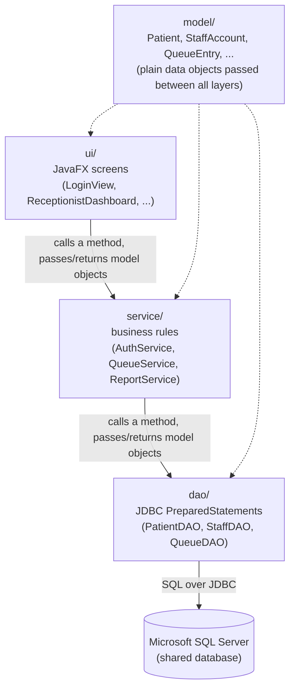

# hospital-queue-management

MediQueue is a Java desktop application designed to digitise patient queue management in hospitals across Zambia. It helps receptionists, nurses, and doctors coordinate patient flow in real time. From registration and triage through to doctor consultation, replacing manual, paper-based tracking with a shared, role-based system that reduces wait-time uncertainty and improves coordination among hospital staff.

## Tech stack

- **Language:** Java 25 (LTS)
- **GUI:** JavaFX 25
- **Build tool:** Maven, using the `javafx-maven-plugin` so the app runs the same way on every machine (`mvn javafx:run`) without anyone having to hand-configure JavaFX module paths
- **Data access:** JDBC (plain `PreparedStatement` queries, no ORM)
- **Database:** Microsoft SQL Server, administered through SSMS

## Project structure

```
hospital-queue-management/
├── README.md
├── .gitignore
├── pom.xml
├── Documentation/
│   ├── MediQueueProjectProposal.docx
│   └── MediQueue Week1 Meeting Minutes.docx
├── database/
│   └── schema.sql             # run once in SSMS to create the four tables below
└── src/
    └── main/
        ├── resources/
        │   ├── db.properties.example   # copy to db.properties and fill in your own details
        │   └── db.properties           # not committed - your own local connection settings
        └── java/
            └── mediqueue/
                ├── Main.java              # application entry point - wires everything together
                │
                ├── model/                 # plain data classes, no logic
                │   ├── Patient.java
                │   ├── StaffAccount.java
                │   ├── Role.java
                │   ├── PatientStatus.java
                │   ├── AvailabilityStatus.java
                │   ├── DoctorAvailability.java
                │   └── QueueEntry.java
                │
                ├── dao/                    # the only place JDBC/SQL code lives
                │   ├── DatabaseConnection.java
                │   ├── PatientDAO.java
                │   ├── StaffDAO.java
                │   ├── DoctorAvailabilityDAO.java
                │   └── QueueDAO.java
                │
                ├── service/                # business rules and role checks; talks to dao/, knows nothing about the UI
                │   ├── AuthService.java
                │   ├── AuthenticationException.java
                │   ├── QueueService.java
                │   ├── ReportService.java
                │   └── DailySummary.java
                │
                ├── ui/                     # JavaFX screens; talk to service/, never touch the database directly
                │   ├── LoginView.java
                │   ├── ReceptionistDashboard.java
                │   ├── NurseDashboard.java
                │   ├── DoctorDashboard.java
                │   └── AdminDashboard.java
                │
                └── util/
                    └── PasswordUtil.java   # password hashing/salting helper
```

## Team setup guide

This section is the full, from scratch setup for a machine that has none of this installed yet. Follow it in order. It has been tested end to end on a real Windows machine, including the mistakes that are easy to make, so the troubleshooting notes below each step are worth reading if something does not work the first time.

### 1. Install Java Development Kit 25

1. Go to [adoptium.net/temurin/releases](https://adoptium.net/temurin/releases) and set the filters to Version 25, Operating System Windows, Architecture x64, Package Type JDK.
2. Download the `.msi` installer and run it (double click the downloaded file - just downloading it is not enough).
3. On the features screen of the installer, make sure **"Set JAVA_HOME variable"** and **"Add to PATH"** are both enabled, not greyed out. This is the step that is easiest to miss.
4. Finish the installer.
5. Close every terminal window you have open, open a brand new one, and run `java -version`. It should print something starting with `openjdk version "25...`.

If `java -version` is not recognised afterwards, first check whether Java actually installed at all: Windows key, search "Installed apps", search that list for "temurin". If it is not listed, the installer did not run to completion, redo steps 1 to 4. If it is listed, JAVA_HOME and PATH were not set automatically, set them by hand: find the install folder (usually `C:\Program Files\Eclipse Adoptium\jdk-25...-hotspot`), create a `JAVA_HOME` environment variable pointing at it, and add `%JAVA_HOME%\bin` to your `Path` environment variable.

### 2. Install Apache Maven

1. Go to [maven.apache.org/download.html](https://maven.apache.org/download.html) and download the **Binary zip archive** (not the source archive).
2. Extract it somewhere permanent, for example `C:\apache-maven-3.9.16` (not a Downloads or Desktop folder you might delete later).
3. Add the `bin` folder inside that extracted folder to your `Path` environment variable, for example `C:\apache-maven-3.9.16\bin`.
4. Close every terminal window, open a brand new one, and run `mvn -v`. It should print the Maven version and, underneath it, a Java version line matching step 1.

**The single most common cause of confusing errors at this stage:** a terminal window (or an already open VS Code window) that was open *before* you changed an environment variable will keep using the old, stale values no matter what you type into it afterwards. Editing environment variables never affects a window that is already open. If a command that should work says it is "not recognised", close every terminal and every VS Code window completely (not just the tab) and open a fresh one before troubleshooting anything else.

### 3. Set up the database in SSMS

1. Open SSMS and connect to your SQL Server instance the way you normally do.
2. Right click **Databases** in Object Explorer -> **New Database...** -> name it `MediQueue` -> OK.
3. Click on the new `MediQueue` database to select it, click **New Query**, and check the database dropdown in the toolbar actually says `MediQueue` (not `master`).
4. Open `database/schema.sql` from this repository, paste its contents into that query window, and run it (F5). It should say the commands completed successfully, and `MediQueue` -> `Tables` should now show `Patient`, `StaffAccount`, `QueueEntry`, and `DoctorAvailability`.
5. Allow SQL logins on this server: right click your server name (top of Object Explorer, not a specific database) -> **Properties** -> **Security** page -> select **"SQL Server and Windows Authentication mode"** -> OK. Then restart the SQL Server service for this to take effect (right click the server -> Restart, or restart it from the Windows Services app).
6. Create the application's own login: Object Explorer -> **Security** -> right click **Logins** -> **New Login...**
   - Login name: `mediqueue_app`
   - Select **SQL Server authentication**, and set a password (invent one, you will use it in step 4 below). Untick "Enforce password policy".
   - Click **User Mapping** on the left, tick the `MediQueue` database, and tick the `db_datareader` and `db_datawriter` roles underneath.
   - Click OK.

### 4. Configure your local database connection

1. Copy `src/main/resources/db.properties.example` to `src/main/resources/db.properties` (same folder).
2. Fill in the three lines, using the password you set in step 3.6:
   ```
   db.url=jdbc:sqlserver://YOUR_SERVER_NAME:1433;databaseName=MediQueue;encrypt=true;trustServerCertificate=true
   db.username=mediqueue_app
   db.password=YourChosenPassword
   ```
   Replace `YOUR_SERVER_NAME` with your computer's name (or the shared server's address, if the team is pointing at one central database), keeping the `//` after `sqlserver:` and the `:1433` port.
3. This file is excluded from git on purpose, since it holds a real password. Never commit it.

**If the app connects but cannot find any account you insert:** this almost always means your machine has more than one SQL Server installation, and SSMS's normal connection is quietly reaching a different one than `db.properties` points at, even though both display the same server name. To check, in SSMS click **Connect -> Database Engine...**, type the exact server name from `db.properties`, choose **SQL Server Authentication**, and log in as `mediqueue_app` with the password from step 3.6. If that connection's copy of `MediQueue` looks empty while your normal connection's copy has data in it, that confirms it, two separate instances exist. From then on, do all your database work (running `schema.sql`, inserting accounts) through this `mediqueue_app` connection specifically, so it always matches what the app itself sees.

### 5. Create your own login account for the app

The application has no built in "first user" - every account is normally created through the Administrator Dashboard, which itself requires being logged in as an administrator already. To create the very first one:

1. Temporarily create a file at `src/main/java/mediqueue/PrintHash.java`:
   ```java
   package mediqueue;

   import mediqueue.util.PasswordUtil;

   /** Temporary helper: prints a password hash for the first admin account. Delete after use. */
   public class PrintHash {
       public static void main(String[] args) {
           System.out.println(PasswordUtil.hash(args[0]));
       }
   }
   ```
2. In a terminal, inside this project folder, run:
   ```
   mvn compile
   java -cp target\classes mediqueue.PrintHash "YourChosenPassword"
   ```
   This prints one long line such as `65536:xxxxx...:yyyyy...`, copy it.
3. In SSMS (using whichever connection step 4's note above says is the correct one for your setup), run:
   ```sql
   INSERT INTO dbo.StaffAccount (FullName, Username, PasswordHash, Role, CreatedAt)
   VALUES ('Your Full Name', 'YourUsername', 'PASTE_THE_HASH_STRING_HERE', 'ADMINISTRATOR', SYSDATETIME());
   ```
4. Delete `PrintHash.java` once you have logged in successfully with your new account, it was only a bootstrapping tool.

### 6. Run the project

```
mvn javafx:run
```

Log in with the username and password you just created. From the Administrator Dashboard, use "Create Staff Account" to add everyone else's real login (receptionist, nurse, doctor accounts) instead of repeating the steps above.

**If `mvn` or `java` stop being recognised again later, or `mvn javafx:run` cannot reach the database:** re-check you are in the `hospital-queue-management` folder (not its parent folder) and that your terminal was opened after any environment variable changes, before assuming the code itself is broken.

## How the parts talk to each other

Each layer only ever talks to the layer directly below it. The UI never writes SQL, and the data access layer never knows what a button looks like - that separation is what keeps the codebase easy to follow as it grows.



A concrete example: a receptionist clicks "Register Patient" in `ReceptionistDashboard` (`ui/`) → that calls `QueueService.registerPatient(patient)` (`service/`), which checks the basic rules and calls `PatientDAO.insert(patient)` and `QueueDAO.addToQueue(patient)` (`dao/`) → those run the actual `INSERT` statements against SQL Server via JDBC → control returns back up through `service/` to `ui/`, which refreshes the on-screen queue. Every station running the app against the same SQL Server instance sees the new patient appear, because they're all reading from the same source of truth.

(See "Team setup guide" above for how to install everything and run the project the first time - once set up, running it day to day is just `mvn javafx:run`.)

## How this was verified so far

The full codebase (every class in `model`, `util`, `dao`, `service`, and `ui`, plus `Main`) compiles cleanly together with no errors, and `PasswordUtil` was additionally exercised end to end with a small throwaway test: a correct password verifies, a wrong password is rejected, and hashing the same password twice produces two different stored hashes, as expected from a random salt.

Beyond that, the application has since been run for real on a Windows machine, following the Team Setup Guide above: `mvn javafx:run` starts the app, it connects to a real SQL Server database over JDBC, and logging in as an administrator successfully reaches the Administrator Dashboard. The setup guide's troubleshooting notes come directly from the real issues hit while doing that first setup (stale terminal environment variables, and a machine with more than one SQL Server instance installed), not from guesswork.

What has not yet been exercised is the day to day feature set itself (registering a patient, running them through triage, assigning a doctor, completing a consultation, the daily report) against a real, populated database - that is the natural next step once more than one account exists to test with.

## Team

- **Henry Chewetu** - created and set up the GitHub repository
- **Alexander Bwalya** - manages project documentation
- **Crispin Libimba** - main developer