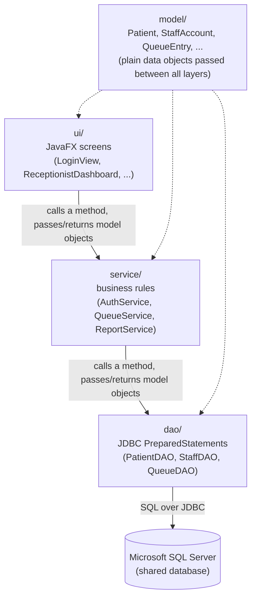

# hospital-queue-management

MediQueue is a Java desktop application designed to digitise patient queue management in hospitals across Zambia. It helps receptionists, nurses, and doctors coordinate patient flow in real time. From registration and triage through to doctor consultation, replacing manual, paper-based tracking with a shared, role-based system that reduces wait-time uncertainty and improves coordination among hospital staff.

## Tech stack

- **Language:** Java 25 (LTS)
- **GUI:** JavaFX 25
- **Build tool:** Maven, using the `javafx-maven-plugin` so the app runs the same way on every machine (`mvn javafx:run`) without anyone having to hand-configure JavaFX module paths
- **Data access:** JDBC (plain `PreparedStatement` queries, no ORM)
- **Database:** Microsoft SQL Server, administered through SSMS

## Project structure

```
hospital-queue-management/
├── README.md
├── .gitignore
├── pom.xml
├── Documentation/
│   ├── MediQueueProjectProposal.docx
│   └── MediQueue Week1 Meeting Minutes.docx
└── src/
    └── main/
        └── java/
            └── mediqueue/
                ├── Main.java              # application entry point
                │
                ├── model/                 # plain data classes, no logic
                │   ├── Patient.java
                │   ├── StaffAccount.java
                │   ├── Role.java
                │   ├── PatientStatus.java
                │   └── QueueEntry.java
                │
                ├── dao/                    # the only place JDBC/SQL code lives
                │   ├── DatabaseConnection.java
                │   ├── PatientDAO.java
                │   ├── StaffDAO.java
                │   └── QueueDAO.java
                │
                ├── service/                # business rules; talks to dao/, knows nothing about the UI
                │   ├── AuthService.java
                │   ├── QueueService.java
                │   └── ReportService.java
                │
                ├── ui/                     # JavaFX screens; talk to service/, never touch the database directly
                │   ├── LoginView.java
                │   ├── ReceptionistDashboard.java
                │   ├── NurseDashboard.java
                │   ├── DoctorDashboard.java
                │   └── AdminDashboard.java
                │
                └── util/
                    └── PasswordUtil.java   # password hashing/salting helper
```

Every file above currently exists but is intentionally empty - this is the project skeleton, not the implementation. Code gets added feature by feature as the team builds it out.

## How the parts talk to each other

Each layer only ever talks to the layer directly below it. The UI never writes SQL, and the data access layer never knows what a button looks like - that separation is what keeps the codebase easy to follow as it grows.



A concrete example: a receptionist clicks "Register Patient" in `ReceptionistDashboard` (`ui/`) → that calls `QueueService.registerPatient(patient)` (`service/`), which checks the basic rules and calls `PatientDAO.insert(patient)` and `QueueDAO.addToQueue(patient)` (`dao/`) → those run the actual `INSERT` statements against SQL Server via JDBC → control returns back up through `service/` to `ui/`, which refreshes the on-screen queue. Every station running the app against the same SQL Server instance sees the new patient appear, because they're all reading from the same source of truth.

## Running the project

```
mvn javafx:run
```

Maven and the `javafx-maven-plugin` handle the JavaFX module-path setup automatically, so this should work the same way on every team member's machine without extra configuration.

## Team

- **Henry Chewetu** - created and set up the GitHub repository
- **Alexander Bwalya** - manages project documentation
- **Crispin Libimba** - main developer
